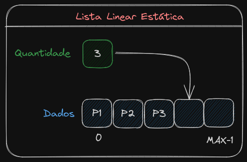

# Lista Linear Estática
 Tipo de lista onde o sucessor de um elemento ocupa
 a posição física seguinte do mesmo.
 </img>

<table border="1">
    <tr>
        <th>Vantagens</th>
        <th>Desvantagens</th>
    </tr>
    <tr>
        <td>Acesso rápido e direto aos elementos.</td>
        <td>Definição prévia do tamanho da lista.</td>
    </tr>
    <tr>
        <td>Tempo constante para acessar um elemento.</td>
        <td>Dificuldade de inserir e remover um elemento entre dois outros (é nescessário fazer deslocamento).</td>
    </tr>
    <tr>
        <td>Facilidade em modificar informação.</td>
        <td></td>
    </tr>

</table>

    
__Quando Utilizar__:

- Listas pequenas.

- Inserção e remoção são apenas no final da lista.

- Tamanho máximo definido.

- A busca é a operação mais frequente.
