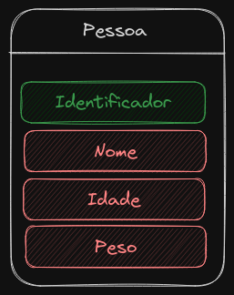

# Listas 
Lista é uma sequencia de elementos do mesmo tipo.

__Tipos de Listas__
- _Estática_ : 
    - O espaço de memória é alocado no momento de compilação. 
    - Exige a definição de número máximo de elementos da lista.
    - O acesso é sequencial (os elementos são consecutivos na memoria).
- _Dinâmica_:
    - O espaço de memória é alocado em tempo de execução.
    - A lista cresce a medida que novos elementos são inseridos e diminui a partir da remoção dos mesmos.
    - O acesso é encadeado (cada elemento pode esta em uma área distinta da memória) é preciso percorre-la
    para encontra o elemento.

__Operações Básicas__
- Criar uma lista
- Inserir um elemento
- Excluir um elemento
- Acessar um elemento
- Destruir uma lista

<h2>Os dados utilizado</h2>
Os dados que serão guardados em todas as estruturas esta a seguir

</img>

Os dados guardados tem a seguinte estrutura
- O elementos são uma estrutura tipo Pessoa
- Tem um campo _ID_ (identificador único) que é um numero inteiro
- Tem um campo _Nome_ que é uma string que armazena o nome da pessoa
- Tem um campo _idade_ que é um numero interio
- Tem um campo _peso_ que é to tipo float
